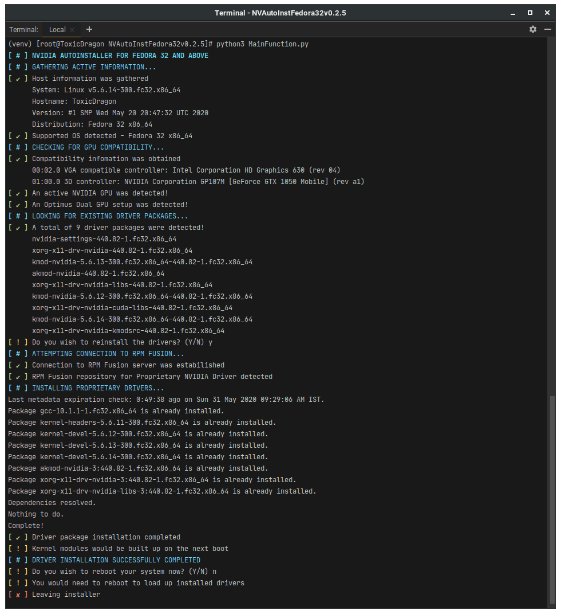

# nvidia-auto-installer-for-fedora
v0.3.0 (04 June 2020)  
A CLI tool which lets you install proprietary NVIDIA drivers and much more easily on Fedora 32 and above

The look and feel is heavily inspired from `systemd` and `eopkg` prompts.

## Requirements
* Active internet connection
* Fedora 32 or above

## Usage
1. Make sure you have a working internet connection
2. Download `NVAutoInstFedora32` from the latest release
3. Make the binary executable by running `chmod +x NVAutoInstFedora32`
3. Execute `sudo ./NVAutoInstFedora32` to check installation modes
4. Give stars to the repository if you found this helpful

## Modes of installation
Active internet connection and superuser privilege is required to execute the following installation modes.
- **`sudo ./NVAutoInstFedora32 --rpmadd`**  
This mode enables the RPM Fusion NVIDIA drivers repository.
- **`sudo ./NVAutoInstFedora32 --driver`**  
This mode simply installs the NVIDIA drivers (with x86_64 deps only). Enabling the RPM Fusion NVIDIA drivers repository is mandatory before doing this.
- **`sudo ./NVAutoInstFedora32 --x86lib`**  
This mode installs only the x86 libraries for Xorg. Enabling the RPM Fusion NVIDIA drivers repository and installing the basic drivers are mandatory before doing this.
- **`sudo ./NVAutoInstFedora32 --nvrepo`**  
This mode enables the official NVIDIA repository for CUDA software.
- **`sudo ./NVAutoInstFedora32 --plcuda`**  
This mode installs only the CUDA support softwares. Enabling the RPM Fusion NVIDIA drivers and NVIDIA official repository, and installing the basic drivers are mandatory before doing this.
- **`sudo ./NVAutoInstFedora32 --ffmpeg`**  
This mode installs only the FFMPEG accleration. Enabling the RPM Fusion NVIDIA drivers repository and installing the basic drivers are mandatory before doing this.
- **`sudo ./NVAutoInstFedora32 --vulkan`**  
This mode installs only the Vulkan renderer. Enabling the RPM Fusion NVIDIA drivers repository and installing the basic drivers are mandatory before doing this.
- **`sudo ./NVAutoInstFedora32 --vidacc`**  
This mode installs only the VDPAU/VAAPI acceleration. Enabling the RPM Fusion NVIDIA drivers repository and installing the basic drivers are mandatory before doing this.
- **`sudo ./NVAutoInstFedora32 --getall`**  
This mode installs all the above packages. (Not been implemented yet)
- **`sudo ./NVAutoInstFedora32 --cheksu`**  
This mode allows you to check the current user privilege level. You can use this tool effectively only when you have logged in as a root or sudo user.
- **`sudo ./NVAutoInstFedora32 --compat`**  
This mode allows you to check your hardware and host compatiblity. The tool would check your hardware and host and tell if your device is supported by the tool or not.
- **`sudo ./NVAutoInstFedora32 --version`**  
This mode would show the tool version and exit out.
- **`sudo ./NVAutoInstFedora32 --help`**  
This mode would show the help message and exit out.

## Note
* Active internet connection is required to download drivers.
* Requires secure boot to be turned off in UEFI systems.
* Requires superuser access for repo addition and driver setup.
* The drivers are fetched from the RPMFusion repository.
* Only tested on Fedora 32 Workstation.
* Use discretion while using this on other spins.
* Only tested on 9XX/10XX/20XX series discrete cards.
* Use discretion while installing with older cards.
* No additional configuration is required for Optimus setups.
* Consider using executables provided in releases section only.

## Coming soon
* CLI "Launch using Dedicated Graphics Card" option.
* Intuitive mode switching for hybrid graphics.
* Distinct mode for using integrated or discrete GPU.
* Experimental support for RHEL 8 and CentOS 8.
* Support for older cards by active querying at NVIDIA.
* Native support for PRIME configuration on Optimus.

## Disclaimer
This tool has been tried and tested multiple times and is expected to work flawlessly in Fedora Workstation 32 or above. It has not been tested on any of the spins yet so proceed with caution. While the chances of things going wrong is pretty slim but still you would want to make backups, should things do not go as expected. As always, you are choosing to use this tool at your will and you cannot hold me responsible for any mishap there may occur due to the misuse of this tool.